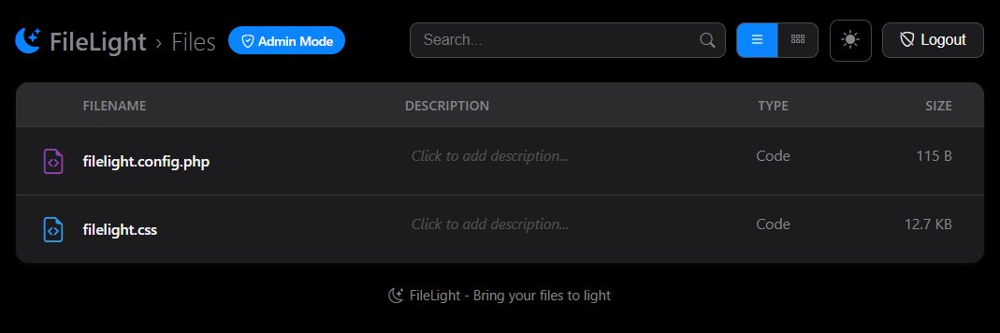
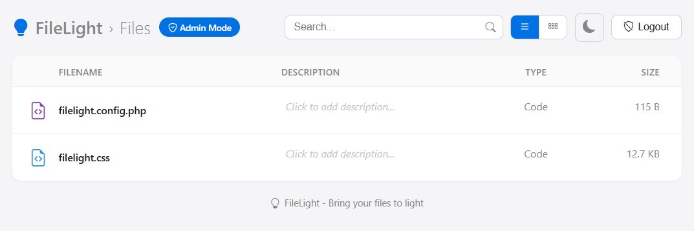

# FileLight

FileLight is a single-file PHP directory browser with a modern UI. It brings grid/list views, dark mode, inline descriptions, search, and admin-only editing without any external dependencies beyond PHP and a Bootstrap Icons CDN include.

<p align="center">
  
  
</p>

## Features
- Clean list + grid views with persistent dark/light theme toggle
- Breadcrumb navigation, search, and sortable columns (name, description, type, size, date)
- Inline image hover previews in list view and thumbnails in grid view
- Admin-only inline editing of file descriptions stored in `DESCRIPT.ION`
- Optional `types.json` support for legacy icon/type mappings
- Respects a hide list (`index.php`, `.htaccess`, `DESCRIPT.ION`, `desc.js`, `_h5ai`) and blocks path traversal above the install directory

## Requirements
- PHP 7.4+ (no extensions beyond the standard library)
- Web server capable of running PHP (or PHP’s built-in server for local use)
- Internet access for the Bootstrap Icons CDN (cached locally by your browser after first load)

## Quick start
1) Copy `index.php`, `filelight.css`, and `filelight.config.php` into the directory you want to expose.  
2) Serve the folder with your web server, or locally via:
```bash
php -S localhost:8000
```
3) Visit `http://localhost:8000` (or your domain). The listing is scoped to the directory containing `index.php`.

## Admin access and passwords
- Default password: `admin123`. On first run, FileLight hashes it and writes the hash into `filelight.config.php`.
- To set a new password, replace `admin_password_hash` in `filelight.config.php` with a bcrypt hash:
```bash
php -r "echo password_hash('your-new-password', PASSWORD_DEFAULT), PHP_EOL;"
```
Plain-text values are automatically hashed on next load; if hashing cannot be written back, the plain text is used as a fallback.
- Click the **Admin** button in the UI to log in. An “Admin Mode” pill appears in the breadcrumb when active. Logout is available in the header.

## Descriptions (`DESCRIPT.ION`)
- Descriptions are stored per directory in a `DESCRIPT.ION` file. FileLight will read a local `DESCRIPT.ION`, falling back to the root one if a subdirectory lacks its own.
- Admins can click a description to edit; emptying a value deletes it.
- Format: one entry per line, filename followed by whitespace or a tab, then the description. Example:
```
README.md                  Project overview and setup
very-long-filename-example.txt\tThis uses a tab because the filename is long
```

## Types mapping (optional)
If you have a legacy `types.json`, place it beside `index.php`; FileLight will parse it (ignoring leading `/* ... */` comments) for compatible icon/type mappings.

## Customization and theming
- Styles live in `filelight.css`; adjust CSS variables at the top for colors and shadows.
- The UI remembers theme and view preferences per browser via `localStorage`.

## Notes and security
- Directory traversal outside the install root is blocked. Keep the script in the top-level directory you intend to expose.
- Hidden items: `index.php`, `.htaccess`, `DESCRIPT.ION`, `desc.js`, `_h5ai`.
- Ensure `filelight.config.php` is writable if you want automatic hashing of new passwords.

## License
MIT License. See `LICENSE` for details.
